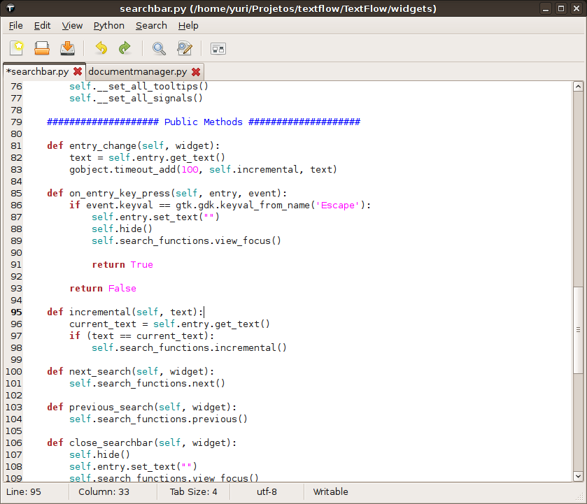

TextFlow Window
====================================

The TextFlow window contains the following elements:

Menubar
------------------------------------
The menubar provides access to the most of commands that you need to work with text files in TextFlow.

Toolbar
------------------------------------
The toolbar provides quick access to some operations of the text editor.

Tabs
------------------------------------
The tabs represents all documents opened. You can change to a document by clicking in the tab with its file name. The **\*** character appears when a document is modified.

All tabs are reordenable, you can drag and drop they.

To close a tab you can click on the **close icon** beside the file name.

Editing Area
------------------------------------
Use the editing area to view and to type text. The editing area highlights syntax according the file. It also shows the line numbers, a right margin and highlight the current line. You can configure to view or not these three options.

Statusbar
------------------------------------
The statusbar displays information about the current document.

The statusbar contains five sections. The first and second show the cursor position, line number and column number, respectivelly. The third section shows the tabulation size of current document. The fourth shows the text encoding used in the document. The last one shows if the document is writable or read only.

.. note::

  The **tab size** and **enconding** sections are clickable. You can change the tabulation size and the current enconding by clicking in the section and choosing a option in the menu. 
